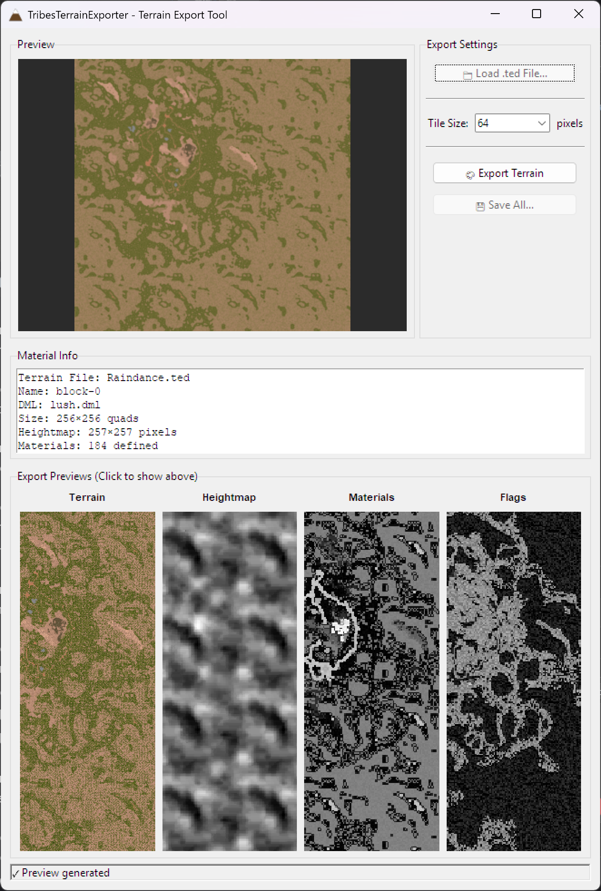

# TribesTerrainExporter 🏔️

> **Starsiege: Tribes Terrain File Exporter**

Export Starsiege: Tribes `.ted` terrain files to heightmaps, material maps, and rendered textures. Features both a GUI for interactive previewing and CLI for batch processing.

[](https://www.gnu.org/licenses/gpl-3.0)
[](https://www.python.org/downloads/)



## ✨ Features

- 🏔️ **Complete Terrain Export** - Heightmaps, material maps, and fully rendered terrain textures
- 🖥️ **Dual Mode Operation** - Interactive GUI or command-line batch processing
-  **Automatic Dependency Management** - Installs NumPy, Pillow, and TribesToBlender on first run
- 👁️ **Live Preview** - See heightmaps, materials, and terrain textures as they generate (GUI mode)
- � **Self-Contained** - Downloads required TribesToBlender modules automatically from GitHub
- 🗜️ **Archive Handling** - Extracts textures from DML.zip and terrain data from Terrain.zip
- 🎨 **DML Parsing** - Full material definition support with texture mapping
- 🔄 **Tile Transformations** - Proper rotation and flip handling based on material flags
- 🎛️ **Configurable Tile Size** - Adjust output resolution (16px to 256px per tile)

## 📋 Requirements

- **Python 3.7+** (with tkinter for GUI mode)
- **Dependencies** (auto-installed on first run):
  - NumPy
  - Pillow

## 🚀 Quick Start

### Installation

1. Clone the repository:
```bash
git clone https://github.com/leeleatherwood/TribesTerrainExporter.git
cd TribesTerrainExporter
```

2. Run the script (dependencies will install automatically):
```bash
python TribesTerrainExporter.py
```

### GUI Mode

Simply run without arguments to launch the interactive GUI:

```bash
python TribesTerrainExporter.py
```

**GUI Workflow:**
1. Click **"Load .ted File..."** to select your terrain file
2. Preview loads automatically (fast 16px preview mode)
3. Click thumbnails to view different outputs (Terrain, Heightmap, Materials, Flags)
4. Adjust **Tile Size** for desired output resolution
5. Click **"Export Terrain"** to generate full-resolution exports
6. Click **"Save All..."** to save all files to disk

> **💡 Tip:** The initial preview uses 16px tiles for speed. Click "Export Terrain" with a larger tile size (64, 128, 256) for high-resolution output.

### Command-Line Mode

For batch processing or automation:

```bash
python TribesTerrainExporter.py <terrain_file> [options]
```

**Examples:**

```bash
# Basic usage with default settings (64px tiles)
python TribesTerrainExporter.py Raindance.ted

# Custom output directory
python TribesTerrainExporter.py Raindance.ted -o ./my_exports

# Higher resolution output (128px tiles = 32768×32768 for 256×256 terrain)
python TribesTerrainExporter.py Raindance.ted --tile-size 128

# Debug mode with tile borders and flag annotations
python TribesTerrainExporter.py Raindance.ted --debug

# Combined options
python TribesTerrainExporter.py Raindance.ted -o ./exports --tile-size 32 -d
```

**CLI Options:**
- `-o, --output` - Output directory (default: `<terrain_name>_export`)
- `-t, --tile-size` - Tile size in pixels: 16, 32, 64, 128, 256 (default: 64)
- `-d, --debug` - Draw borders and flag values on tiles

## 📁 Directory Structure

```
TribesTerrainExporter/
├── TribesTerrainExporter.py    # Main script
├── Raindance.ted               # Example terrain file
├── dml/                        # DML material definitions & archives
│   ├── lush.dml                # Extracted DML files
│   ├── desert.dml
│   ├── *DML.zip                # Optional: DML archives (for texture extraction)
│   └── ...
├── textures/                   # Texture PNG files (extracted from DML.zip)
│   └── *.png
└── terrain_archives/           # Optional: *Terrain.zip files (for DML extraction)
    └── *.zip
```

## 📸 Output

The tool generates Unity-ready terrain data:

### Generated Files
- **`<terrain>_heightmap.png`** - 16-bit PNG heightmap (0-65535 range)
- **`<terrain>_heightmap.raw`** - Raw 16-bit little-endian (Unity-compatible)
- **`<terrain>_materials_raw.bmp`** - Raw material indices
- **`<terrain>_materials_vis.bmp`** - Visualization (scaled for visibility)
- **`<terrain>_material_flags_raw.bmp`** - Raw flag values
- **`<terrain>_material_flags_vis.bmp`** - Visualization (scaled for visibility)
- **`<terrain>_terrain_texture.png`** - Fully assembled terrain texture
- **`<terrain>_meta.txt`** - Terrain metadata and statistics

### Tile Size vs Output Resolution

For a 256×256 quad terrain (like Raindance):

| Tile Size | Output Texture Size |
|-----------|---------------------|
| 16 px     | 4096×4096 pixels    |
| 32 px     | 8192×8192 pixels    |
| 64 px     | 16384×16384 pixels  |
| 128 px    | 32768×32768 pixels  |
| 256 px    | 65536×65536 pixels  |

## 🔧 How It Works

1. **Dependency Check** - Installs NumPy and Pillow if missing
2. **TribesToBlender Download** - Fetches required modules from GitHub (bovidi branch)
3. **Archive Extraction** - Extracts textures from `*DML.zip` and DML files from `*Terrain.zip`
4. **Terrain Parsing** - Reads `.ted` file (handles both plain and zipped formats)
5. **DML Parsing** - Loads material definitions and maps to texture files
6. **Data Export** - Generates heightmaps and material/flag maps
7. **Texture Rendering** - Assembles tiles with proper transformations (rotations, flips)

## 📊 Example: Raindance

```bash
python TribesTerrainExporter.py Raindance.ted
```

**Expected Output:**
- Terrain size: 256×256 quads
- Heightmap: 257×257 pixels
- With 64px tiles: 16384×16384 pixel terrain texture
- Materials: 184 defined, ~104 unique used
- Flags: 31 unique transformation values

## 🤝 Contributing

Contributions are welcome! Please feel free to submit a Pull Request.

## 📄 License

This project is licensed under the GNU General Public License v3.0 - see the [LICENSE](LICENSE) file for details.

## 🙏 Acknowledgments

- **[TribesToBlender](https://github.com/tekrog/TribesToBlender)** - For the incredible reverse-engineering work and file format parsers
- Part of the **TribesToBlender** project for bringing classic Tribes game assets into modern engines

Shazbot! 🔥

---

## ⚠️ Disclaimer

This tool was **vibe coded** using **GitHub Copilot (Claude Opus 4.5)** by an author who freely admits to knowing **absolutely nothing about Python**.
